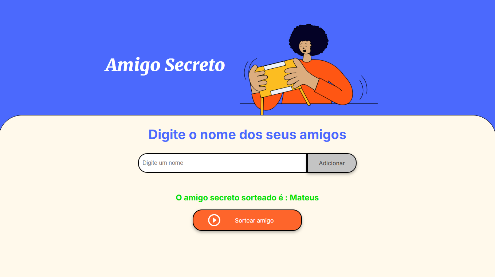

# Amigo Secreto App 🎉

Um pequeno aplicativo web para o Curso de Praticando Logica de programação: Challenge amigo secreto
Alura + ONE

---

## 🚀 Tecnologias Utilizadas

-  **HTML**: Estrutura da interface.
-  **CSS**: Estilização da página.
-  **JavaScript**: Lógica e interatividade do aplicativo.

---

## 🌟 Funcionalidades

1. **Adicionar amigos**: Insira o nome de amigos na lista.
2. **Exibir lista**: Visualize os amigos adicionados.
3. **Sortear amigo secreto**: Realize o sorteio de um amigo secreto aleatório.
4. **Resetar lista**: Após o sorteio, a lista é automaticamente limpa para um novo sorteio.

---

## 📸 Screenshots

| Tela              | Descrição                                          |
|-------------------|--------------------------------------------------|
|  | **Tela inicial**: Campo para inserir amigos e botões de ação. |
|  | **Lista de amigos**: Exibição dinâmica dos amigos adicionados. |
|  | **Resultado do sorteio**: Exibe o amigo sorteado. |

---


## ⚙️ Como Usar

1. **Clone o repositório**:
   ```bash
   git clone https://github.com/mauricioliveir/amigo-secreto
   ```

2. **Abra o arquivo `index.html`** no navegador.

3. Utilize os campos e botões:
   - Insira o nome de um amigo e clique em "Adicionar Amigo".
   - Visualize a lista dinâmica.
   - Clique em "Sortear" para descobrir o amigo secreto.

---

## 🛠️ Estrutura do Projeto

```plaintext
amigo-secreto/
├── assets/
├── index.html   # Estrutura HTML
├── style.css    # Estilização CSS
└── script.js    # Lógica em JavaScript
```

---

## ✨ Exemplo de Código Principal

```javascript
let amigos = [];

function adicionarAmigo() {
    let nome = document.getElementById("amigo").value;

    if (nome == '') {
        alert('Por favor, insira um nome válido!');
    } else {
        amigos.push(nome);
        mostrarLista();
        document.getElementById("amigo").value = '';
    }
}

function mostrarLista() {
    let ul = document.getElementById("listaAmigos");
    ul.innerHTML = "";

    let i = 0;
    while (i < amigos.length) {
        let item = document.createElement("li");
        item.textContent = amigos[i];
        ul.appendChild(item);
        i++;
    }
}

function sortearAmigo() {
    if (amigos.length == 0) {
        alert('A lista está vazia. Por favor, adicione amigos!');
    } else {
        let posicao = Math.random() * amigos.length;
        let sorteado = amigos[parseInt(posicao)];

        let resultado = document.getElementById("resultado");
        resultado.innerHTML = "<li>O amigo secreto sorteado é : " + sorteado + "</li>";
        
        document.getElementById("listaAmigos").innerHTML = "";
        amigos = [];
    }
}
```

---

## 💡 Melhorias Futuras

- Adicionar um botão para limpar a lista sem realizar sorteio.
- Ocultar o botão sortear enquanto a lista estiver vazia.
- Habilitar o botão sortear apenas quando houver pelo menos um amigo na lista.
- Habilitar o botão adicionar apenas quando o campo de texto estiver preenchido.
- Implementar lógica para evitar nomes duplicados.
- Permitir salvar e carregar listas de amigos previamente criadas(ex.: amigos.csv).


---

## 🧑‍💻 Autor
## 🧑‍💻 Autor

<div style="display: inline-block; text-align: center; border: 2px solid #e1e4e8; border-radius: 8px; padding: 10px; width: 150px;">

  

  <p style="margin: 10px 0 0; font-weight: bold;">Mauricio De Oliveira</p>

</div>